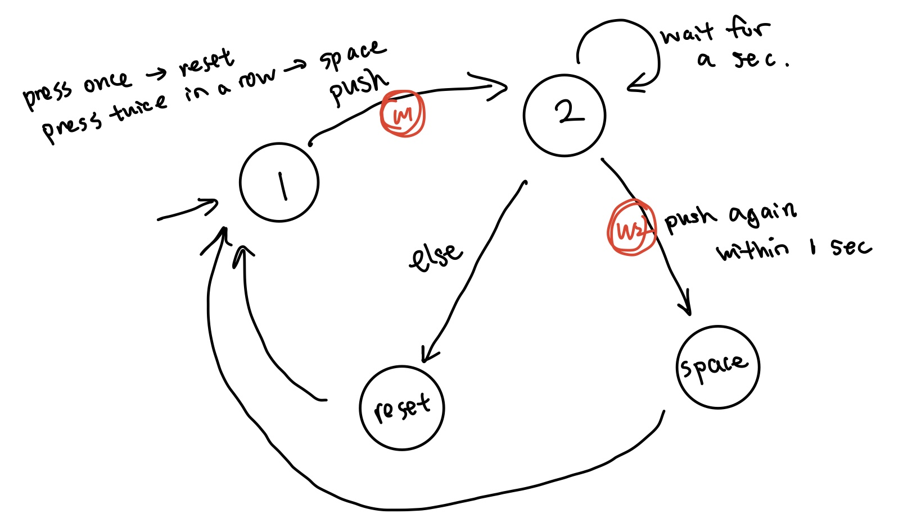

# Overview

This is an writeup for morse code system design exercise. I implemented a system to enter words in Morse Code and which I use to post messages to a server. Below are the details.

[demonstration video](https://youtu.be/lAxaV5m1hr8)

# Summary

## Design of FSMs
In this design exercise, I implemented a state machine for each button's operation. 
While button 1,2, and 4 FSMs are all using the same structure, button 3 FSM has a more complicated design with 6 states (below).



In particuar, state 1 is a start state, and it transits to state 2 through waiting state 1 upon the first button push. If any button push happens within the 1-second waiting period ("press twice in a row"), it will go into Space state and thus add a space to the screen. Else, it will reset the letter after the waiting period. Both cases it will transit back to state 1 after their operations.

As mentioned, button 1,2, and 4 FSM use the same structure. Each has a start state and a push state. Upon a button push, it will go into push state, do the required corresponding operation, and go back to start state upon releasing the button to ensure we don't overcount the number of pushes.

## Use of Dictionary Data Structure
For good coding practice, I build the morse table similar to `dictionary` data type in python.
```
typedef struct
{
  char *morse;
  char *ascii;
} morse_table;
```

```
void mose_lookUp(char input[100]){
  morse_table table[] = {
      {".-", "A"},
      {"-...", "B"},
      ...
      \\for the full table, see source code
  };

  for(int i = 0; i<36; ++i){
    if (!strcmp(input, table[i].morse))
      strcat(str,table[i].ascii);
    }
}
```
Whenever `mose_lookUp` is being called in button 3 operation, we look up `input` array in this mose dictionary, and concatenate the symbol we found with `str` to display on the LCD screen. Note that I use `input`  to store dash and dot from button 1 and 2 operations, and display `str` on the screen.

## Minor details
The following block of codes are added multiple times in button FSMs to prevent button bouncing.
```
while (millis()-primary_timer<LOOP_PERIOD); //wait for primary timer to increment
        primary_timer =millis();
```


